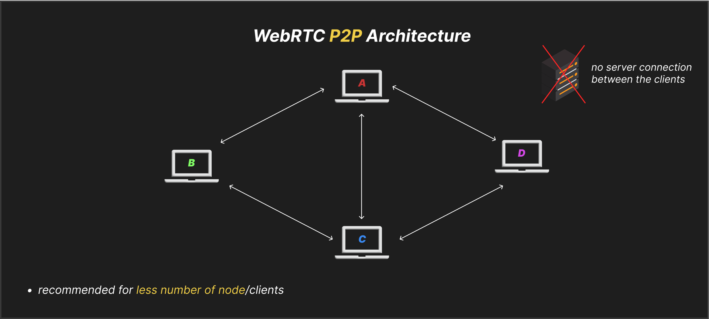
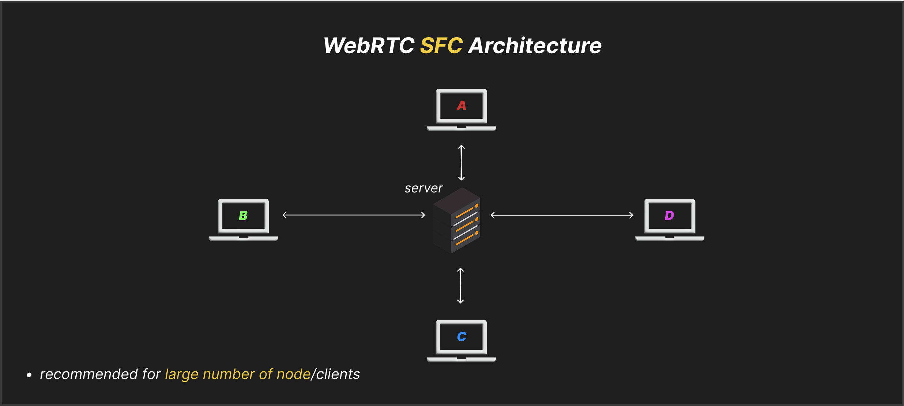

# Video Conferencing with WebRTC and Computer Networking Concepts

## Sockets

* one endpoint of a connection.
* these endpoints consist of (IP address + port).
* these connections are between client-client, client-server, server-server.
* a machine can have multiple sockets or endpoints.

## Protocols

* communication rules

### TCP (Transmission Control Protocol)

* slow and reliable (keeps the integrity of data).
* applications in file uploading in drive.
* every single data packet is transferred.
* also known as connection-based protocol.

### UDP (User Datagram Protocol)

* relatively faster and less reliable than TCP.
* application in video conferencing.
* may miss few data packets, here speed is priority.
* known as connectionless-based protocol.

## WebRTC for Video Communication

* Web Real Time Communication.
* primarily built on top of UDP, with some other individual protocols as well like (STUN, TURN, DTLS).
* used for low-latency peer-to-peer communication.
* also called bi-directional communication.

Note:

1. bi-directional communication, meaning once a connection is established between two peers (IP + port), both can continuously send and receive data (video, audio, text, files, etc.) over the same session/connection.
2. uni-directional communication (like HTTP requests) establishes a new connection each time, sends data one way, and then closes it, so it doesn’t allow continuous two-way exchange on the same connection.

### How does WebRTC work?

* four stages:

1. `Signalling` (we have a signalling server, helps to exchange the socket information with clients, it uses `SDP` protocol.)
2. `Connecting` (connection forms using `ICE` protocol, and signalling server work is over here.)
3. `Securing` (securing the communication with `DTLS` and `SRTP` protocol.)
4. `Communicating` (finally communication and data transfer happen with `RTP` and `SCTP` protocol.)

## Implementing WebRTC

* WebRTC technology is already present in our browsers in form of inbuilt APIs.
* Some of these APIs are `MediaStream`, `RTCPeerConnection`, `RTCDataChannel`.
* These APIs have functions, which can be utilised to implement WebRTC features.

## WebRTC Architectures:

1. P2P (Peer to Peer)
2. SFU (Selective Forwarding Unit)
3. MCU (Multi-point Control Unit)

### P2P Architecture:

* Suppose we have four clients (A, B, C, D).
* So A has an individual bi-directional connection with B, C, D.
* And similarly all other clients B, C, D have their individual connection with all the clients.
* This type of architecture is called a P2P.
  
* As P2P is a serverless architecture, the load is majorly on the client (node), therefore this architecture is recommended for fewer numbers of nodes.
* As it fully depends on the client resources, if the internet bandwidth limit is exceeded, the client side might get crashed.
* And the advantage is that, as we are sharing the data to each node separately, there is a larger scope of customization.

### SFU Architecture:

* Here, we have a server in between all the connections of clients.
  
* Here each node has to send data only one time, to server.
* And server sends that data to other nodes individually.
* Load is on server here.
* A special advantage of server is that if a node is having high load, the server will send fewer data packets in order for the node to manage the load, or even just send audio in place of video (in video conferencing application).

### Conclusion between P2P and SFU:

* Suppose we have n nodes/clients.
* In `P2P`, each node has to `upload the data n times`, and `download the data n times`.
* In `SFU`, each node has to `upload the data one time`, and `download the data n times`.
* And generally the limit on uploading data is much less than that of downloading limit in modern devices.
* So we can say that SFU is a more scalable architecture than P2P for a larger number of users.

### MCU Architecture:

* Same as SFU, the difference is that the server combines all the nodes' data and sends back to each node, this way each node just has to `upload and download the data only one time`, irrespective of how many nodes are present.
* The load is very high on server here.
* Recommended for very large number of nodes.
* Application: YouTube live streaming, broadcasting etc.
