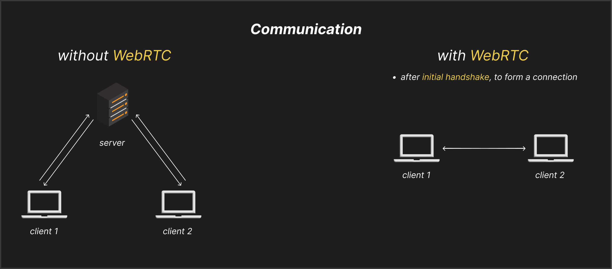

# Video Conferencing with WebRTC and Computer Networking Concepts

## Sockets

* one endpoint of a connection.
* these endpoints consist of (IP address + port).
* these connections are between client-client, client-server, server-server.
* a machine can have multiple sockets or endpoints.

## Protocols

* communication rules

### TCP (Transmission Control Protocol)

* slow and reliable (keeps the integrity of data).
* applications in file uploading in drive.
* every single data packet is transferred.
* also known as connection-based protocol.

### UDP (User Datagram Protocol)

* relatively faster and less reliable than TCP.
* application in video conferencing.
* may miss few data packets, here speed is priority.
* known as connectionless-based protocol.

## WebRTC for Video Communication

* Web Real Time Communication.
* primarily built on top of UDP, with some other individual protocols as well like (STUN, TURN, DTLS).
* used for low-latency peer-to-peer communication.
* also called bi-directional communication.

Note:

1. bi-directional communication, meaning once a connection is established between two peers (IP + port), both can continuously send and receive data (video, audio, text, files, etc.) over the same session/connection.
2. uni-directional communication (like HTTP requests) establishes a new connection each time, sends data one way, and then closes it, so it doesn’t allow continuous two-way exchange on the same connection.

### How does WebRTC work?

* four stages:

1. `Signalling` (we have a signalling server, helps to exchange the socket information with clients, it uses `SDP` protocol.)
2. `Connecting` (connection forms using `ICE` protocol, and signalling server work is over here.)
3. `Securing` (securing the communication with `DTLS` and `SRTP` protocol.)
4. `Communicating` (finally communication and data transfer happen with `RTP` and `SCTP` protocol.)

## Implementing WebRTC
* soon